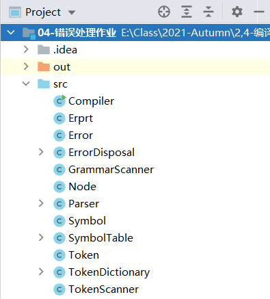
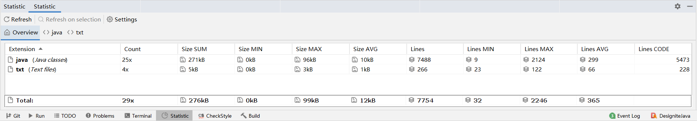
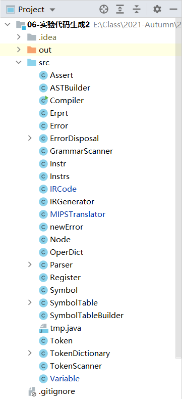
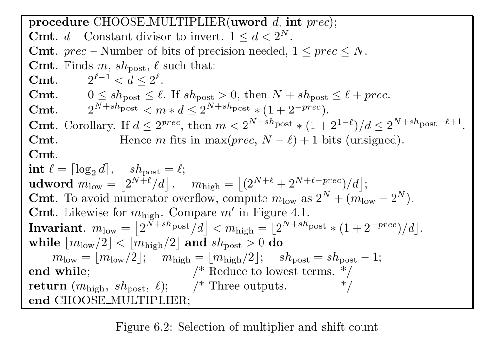
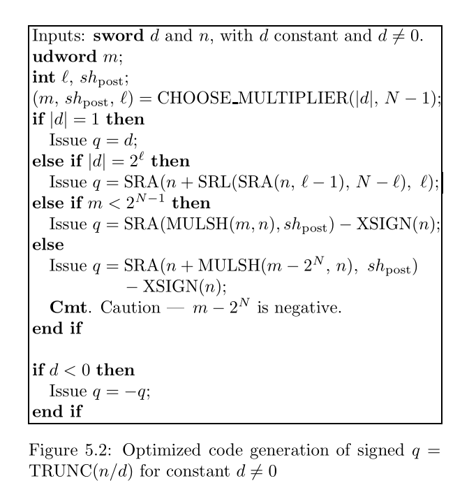
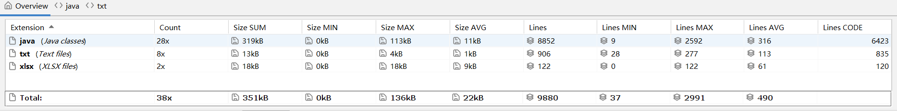
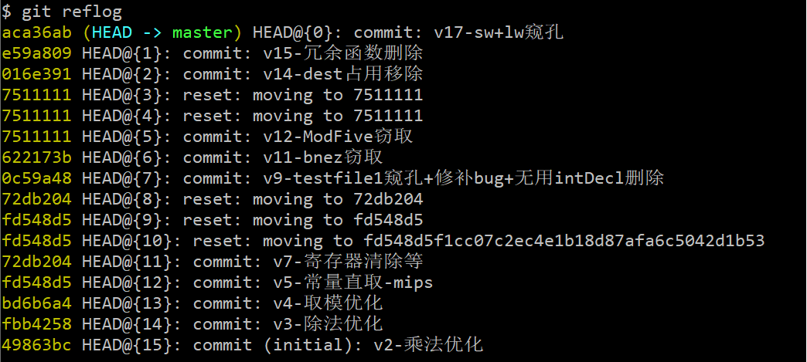
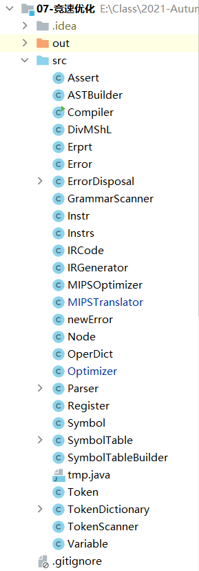

Course Design of Compiling.

Autumn 2021. BUAA.

# 编译器设计文档

## 总体架构

采用Java语言编写

## 一、词法分析

格式及内容不限，每个阶段均需写出编码之前的设计，编码完成之后对设计的修改情况。至错误处理阶段完成后，整体架构与文件如下图所示（部分类未用到）：



### 类的设计

本阶段（词法分析）设计了4个类，分别为Compiler、Token、TokenDictionary、TokenScanner，依次介绍每个类的架构及其功能。

+ Compiler.java：程序的主入口，生成新的实例TokenScanner并运行。
+ Token.java：单词类，当识别到特定满足词法的字符时创建为此类，所有识别到的Token存入ArrayList中。包含如下属性：
  + tokenCode：String类型的单词类别码，与题目要求一致。
  + tokenValue：String类型，单词对应的字符或字符串形式。
  + row：int类型，标识该单词所在行数，为后续错误处理部分铺垫。
+ TokenDictionary.java：建立编码字典的类，内部包含多个HashMap容器存储字符对应的类别映射，同时包含多个查询方法为字符扫描时服务。
+ TokenScanner.java：扫描与处理的核心类，采用的是单个字符单个字符读入并分类判断的设计思路。

### 流程设计

1. 首先借助FileReader读取文件
2. 每次读入对文件中单个字符，利用TokenDictionary中的queryCharType()方法查询字符对应的种类，分为DIGIT（数字）、LETTER（字母）、OPERATOR（操作符）、SPACE（空白符）四类，并充分考虑判断细节、分类后续处理
3. 检测到符合词法的单词后，为每个单词生成Token类并存入TokenList中；之后继续读取、处理后续字符
4. 全部读取结束后，将中间结果输出到文件中

### 编码设计

采用了与题目要求一致的编码方式，如下：

| 单词名称         | 类别码     | 单词名称 | 类别码   | 单词名称 | 类别码 | 单词名称 | 类别码  |
| ---------------- | ---------- | -------- | -------- | -------- | ------ | -------- | ------- |
| **Ident**        | IDENFR     | !        | NOT      | *        | MULT   | =        | ASSIGN  |
| **IntConst**     | INTCON     | &&       | AND      | /        | DIV    | ;        | SEMICN  |
| **FormatString** | STRCON     | \|\|     | OR       | %        | MOD    | ,        | COMMA   |
| main             | MAINTK     | while    | WHILETK  | <        | LSS    | (        | LPARENT |
| const            | CONSTTK    | getint   | GETINTTK | <=       | LEQ    | )        | RPARENT |
| int              | INTTK      | printf   | PRINTFTK | >        | GRE    | [        | LBRACK  |
| break            | BREAKTK    | return   | RETURNTK | >=       | GEQ    | ]        | RBRACK  |
| continue         | CONTINUETK | +        | PLUS     | ==       | EQL    | {        | LBRACE  |
| if               | IFTK       | -        | MINU     | !=       | NEQ    | }        | RBRACE  |
| else             | ELSETK     | void     | VOIDTK   |          |        |          |         |

### 设计修改

+ 与设计时的架构相比无变化，主要的改动可能是TokenDictionary.java类中的一些判断细节进行了改动，如增加对注释的符号“/”、“*”等的支持，之前遇到此类符号会导致错误

## 二、语法分析

### 类的设计

本阶段（语法分析）新增了1个类，为GrammarScanner，其功能介绍如下：

+ GrammarScanner.java：对语法进行扫描的类，其中包含了全部文法定义中的非终结符类型，可对之前阶段得到的Token进行扫描分析语法结构，若出现文法上的错误可报错。

### 流程设计

+ 依照课程组给出的文法，对每个语法部分独立编写函数，并递归调用检测文法的合法性，当发现错误时跳转到错误处理并对应错误信息。当每个语法部分结束时，打印输出该语法部分的名称，从而达到题目要求。此处采用的是提前偷窥、满足左递归与不进行回溯的设计方案。

+ 如，举例对CompileUnit的处理与调用如下：

  ```java
  private void CompUnit() {
          while ((symCodeIs("CONSTTK") && symPeek("INTTK", 1) && symPeek("IDENFR", 2)) ||
                  (symCodeIs("INTTK") && symPeek("IDENFR", 1) && symPeek("LBRACK", 2)) ||
                  (symCodeIs("INTTK") && symPeek("IDENFR", 1) && symPeek("ASSIGN", 2)) ||
                  (symCodeIs("INTTK") && symPeek("IDENFR", 1) && symPeek("COMMA", 2)) ||
                  (symCodeIs("INTTK") && symPeek("IDENFR", 1) && symPeek("SEMICN", 2)) ||
                  (symCodeIs("INTTK") && symPeek("IDENFR", 1) && !symPeek("LPARENT", 2))
          ) {
              Decl();
          }
          while ((symCodeIs("VOIDTK") && symPeek("IDENFR", 1) && symPeek("LPARENT", 2)) ||
                  (symCodeIs("INTTK") && symPeek("IDENFR", 1) && symPeek("LPARENT", 2))
          ) {
              FuncDef();
          }
          isGlobal = false;
          MainFuncDef();
          grammarList.add("<CompUnit>");
      }
  ```

  深入到Decl()部分，则向底层逐步调用ConstDecl()与VarDecl，依此类推：

  ```java
  private void Decl() {
          if (symIs("const")) {
              ConstDecl();
          } else {
              VarDecl();
          }
          //grammarList.add("<Decl>");
      }
  ```

### 输出设计

+ 由于要求将终结符与非终结符部分混合输出至一个文件中，因此设置了一个ArrayList类型的grammarList变量，当一个单元执行结束时将数据输入到外部文件中

  ```java
  public void start(int output) {
          CompUnit();
          if (output == 1) {
              try {
                  writefile(OUTPUT_DIR);
              } catch (IOException e) {
                  e.printStackTrace();
              }
          }
      }
  
  public void writefile(String dir) throws IOException {
          File file = new File(dir);
          FileWriter writer = new FileWriter(file);
          System.out.println("开始输出：");
          for (String t : grammarList) {
              System.out.println(t);
              writer.write(t + "\n");
          }
          writer.flush();
          writer.close();
      }
  ```

### 设计修改

+ 与设计时的架构相比无变化，主要的改动是GrammarScanner.java类中的存在左递归的文法部分的输出（如AddExp）进行了改动，因为在编写递归调用逻辑时，是按消除左递归后的文法进行的，因此需要补充输出一些单元才能符合题意

## 三、错误处理

+ 下表为课程组给出的a到m这几种错误类型，包含了类别码、解释与文法中可能存在的地方，下文将对每一错误类别介绍具体错误检查的设计方案。

| **错误类型**                         | **错误类别码** |                             解释                             | 对应文法及出错符号(…省略该条规则后续部分)                    |
| ------------------------------------ | -------------- | :----------------------------------------------------------: | ------------------------------------------------------------ |
| 非法符号                             | a              | 格式字符串中出现非法字符报错行号为**<FormatString>**所在行数。 | <FormatString> → ‘“‘{<Char>}’”’                              |
| 名字重定义                           | b              | 函数名或者变量名在**当前作用域**下重复定义。注意，变量一定是同一级作用域下才会判定出错，不同级作用域下，内层会覆盖外层定义。报错行号为**<Ident>**所在行数。 | <ConstDef>→<Ident> …<VarDef>→<Ident> … \|<Ident> … <FuncDef>→<FuncType><Ident> …<FuncFParam> → <BType> <Ident> ... |
| 未定义的名字                         | c              |     使用了未定义的标识符报错行号为**<Ident>**所在行数。      | <LVal>→<Ident> …<UnaryExp>→<Ident> …                         |
| 函数参数个数不匹配                   | d              | 函数调用语句中，参数个数与函数定义中的参数个数不匹配。报错行号为函数调用语句的**函数名**所在行数。 | <UnaryExp>→<Ident>‘(’[FuncRParams ]‘)’                       |
| 函数参数类型不匹配                   | e              | 函数调用语句中，参数类型与函数定义中对应位置的参数类型不匹配。报错行号为函数调用语句的**函数名**所在行数。 | <UnaryExp>→<Ident>‘(’[FuncRParams ]‘)’                       |
| 无返回值的函数存在不匹配的return语句 | f              |               报错行号为**‘return’**所在行号。               | <Stmt>→‘return’ {‘[’Exp’]’}‘;’                               |
| 有返回值的函数缺少return语句         | g              | 只需要考虑函数末尾是否存在return语句，**无需考虑数据流**。报错行号为函数**结尾的****’}’**所在行号。 | FuncDef → FuncType Ident ‘(’ [FuncFParams] ‘)’ BlockMainFuncDef → 'int' 'main' '(' ')' Block |
| 不能改变常量的值                     | h              | <LVal>为常量时，不能对其修改。报错行号为**<LVal>**所在行号。 | <Stmt>→<LVal>‘=’ <Exp>‘;’\|<LVal>‘=’ ‘getint’ ‘(’ ‘)’ ‘;’    |
| 缺少分号                             | i              |          报错行号为分号**前一个非终结符**所在行号。          | <Stmt>,<ConstDecl>及<VarDecl>中的';’                         |
| 缺少右小括号’)’                      | j              |        报错行号为右小括号**前一个非终结符**所在行号。        | 函数调用(<UnaryExp>)、函数定义(<FuncDef>)及<Stmt>中的')’     |
| 缺少右中括号’]’                      | k              |        报错行号为右中括号**前一个非终结符**所在行号。        | 数组定义(<ConstDef>,<VarDef>,<FuncFParam>)和使用(<LVal>)中的']’ |
| printf中格式字符与表达式个数不匹配   | l              |               报错行号为**‘printf’**所在行号。               | Stmt →‘printf’‘(’FormatString{,Exp}’)’‘;’                    |
| 在非循环块中使用break和continue语句  | m              |       报错行号为**‘break’**与’**continue’**所在行号。        | <Stmt>→‘break’‘;’\|‘continue’‘;’                             |

### 类的设计

+ 本阶段（错误处理）新增了5个类，分别为Erprt、Error、ErrorDisposal、Symbol、SymbolTable，依次介绍每个类的架构及其功能。

  + Erprt.java：方便输出错误信息设立的类，每一条错误信息的类即为Erprt对象，包含如下两个属性：
    + row：int类型，为错误Token所在的行号；
    + type：String类型，取值从a-m，表示错误种类
  + Error.java：错误类，包含错误类型、错误码，以及输出的错误信息等内容
  + ErrorDisposal.java：错误处理的核心功能类，包含了标识状态的多种全局变量，对a-m大部分错误情况的检查、添加的方法，以及最后对输出的处理。
  + Symbol.java：构成符号表的基本单元符号类，种类复杂，包含如下属性：
    + name：String类型，符号名称，如函数或变量名；
    + type：符号种类，包含Int、Void、Func多种类型；
    + isConst：标识该符号是否为常量的布尔变量；
    + isArray：标识该符号是否为常量的布尔变量；
    + arrayDimen：Int类型，仅当该符号为数组时有效，标记数组的维度信息（仅为int类型时默认为0）；
    + funcReturnType：仅当该符号为函数时有效，标记函数的返回值类型；
    + paralist：ArrayList\<Symbol\>类型，仅当该符号为函数时有效，标记函数的变量表；
    + errorE：boolean类型，仅当该符号为函数时有效，辅助标记函数是否具有e类错误的标识；
  + SymbolTable.java：符号表类，包含了子类Scope（作用域）管理作用域的变化情况。
    + headerScope：Scope类型静态变量，表示当前所在作用域，随语句的扫描情况实时更新；
    + symbolTable：子类Scope中的属性，为ArrayList\<Symbol\>类型，表示了一个作用域Scope中的符号表情况；
    + father：子类Scope中的属性，Scope类型，标记当前作用域的父作用域情况，若为null则表明当前作用域为最顶层的函数主体

### 错误检查设计

#### 错误a

+ FormatString中包含非法符号的情况：处理方式为对每一处FormatString作检查，当检测到包含非法符号时（字符的ASCII码不在指定范围内）抛出a类错误。核心代码：

  ```java
  //格式字符串中出现非法字符，报错行号为<FormatString>所在行数。
      private boolean checkErrorA(String formatstring) {
          int index = 0;
          formatstring = formatstring.substring(1, formatstring.length() - 1);
          while (index < formatstring.length()) {
              char c = formatstring.charAt(index);
              int a = (int) c;
              if (a == 32 || a == 33 || (a >= 40 && a <= 126 && a != 92)) {
                  index += 1;
              } else if (a == 37) {
                  if (index + 1 < formatstring.length() && formatstring.charAt(index + 1) == 'd') {
                      index += 2;
                  } else {
                      return true;
                  }
              } else if (a == 92) {
                  if (index + 1 < formatstring.length() && formatstring.charAt(index + 1) == 'n') {
                      index += 2;
                  } else {
                      return true;
                  }
              } else {
                  return true;
              }
          }
          return false;
      }
  ```

#### 错误b-c

+ 名字重定义或未定义的情况：处理方式为建立符号表，对于B类重定义的情况，每次调用该标识符时检查在当前作用域下是否已定义具有相同名字的函数名或变量名？对于C类错误，则检查表中所有数据检测是否有未定义的情况。其中，核心的查询符号表的函数如下：

  ```java
  public Symbol lookupLocalTable(String name, Parser.TYPE type) {
          Iterator<Symbol> it = headerScope.symbolTable.iterator();
          while (it.hasNext()) {
              Symbol sb = it.next();
              if (sb.getName().equals(name) && sb.getType() == type) {
                  return sb;
              }
          }
          return null;
      }
  
      public Symbol lookupGlobalTable(String name, Parser.TYPE type) {
          Scope sc = headerScope;
          while (sc.father != null) {
              sc = sc.father;
              Iterator<Symbol> it = sc.symbolTable.iterator();
              while (it.hasNext()) {
                  Symbol sb = it.next();
                  if (sb.getName().equals(name) && sb.getType() == type) {
                      return sb;
                  }
              }
          }
          return null;
      }
  ```

#### 错误d-e

+ 函数调用语句中，参数个数或类型不匹配的情况

  + 对于d类错误及函数参数个数不匹配的情况，分两个部分进行处理，首先在函数定义时为函数记录下该函数名拥有的参数以及其类型、个数等特征，之后在函数调用时对参数个数进行计数，若不匹配则抛出D类错误。
  + 对于e类函数参数类型不匹配的情况，在每一个函数参数进行检查时标记该参数的维度，由于仅有二维数组、一维数组、整数，以及void等类型的情况，且仅需考虑数据的维度是否匹配，因此分别将这些参数的维度定义为2、1、0以及任意负数，检测函数对应位置参数的维度与此时传入参数的维度是否相同，若不相同则抛出e类错误

+ 当调用函数时，处理逻辑如下：

  ```java
  if (symCodeIs("IDENFR") && symPeek("LPARENT", 1)) {
              Symbol thisFunc = null;
              boolean dupfunc = false;
  
              if (checkErrorC(sym, Parser.TYPE.F)) {
                  erdp.ErrorAt(sym, ErrorDisposal.ER.ERR_C);
                  dupfunc = true;
              } else {
                  thisFunc = table.lookupFullTable(sym.getTokenValue(), Parser.TYPE.F);
                  Parser.TYPE thisfuncRtype = thisFunc.getFuncReturnType();
                  curDimen = (thisfuncRtype == Parser.TYPE.I) ? 0 : -20;
              }
              Token possibleID = sym;
  
              getsym();
              getsym();
  
              funcParaIndex = 0;
              int paranum = 0;
              if (thisFunc != null) {
                  thisFunc.errorE = false;    //todo 可能全局的errorE被内层覆盖了【并没有】
              }
  
              if (symIs(")")) {
                  getsym();
              } else if (symIs("]")) {
                  erdp.ErrorAt(getLastToken(), ErrorDisposal.ER.ERR_J);
              } else {
                  if (!dupfunc) {
                      int tmp = curDimen;
                      paranum = FuncRParams(thisFunc);
                      curDimen = tmp;
                  }
                  match(")");
              }
  
              if (!dupfunc) {
                  if (thisFunc.getParaNum() != paranum) {
                      System.out.println("期望参数个数：" + thisFunc.getParaNum() + "; 实际参数个数：" + paranum);
                      erdp.ErrorAt(possibleID, ErrorDisposal.ER.ERR_D);
                  } else if (thisFunc.errorE) {    //todo 可能funcE全局导致嵌套函数报错N次【并没有】
                      //Erprt e = new Erprt(possibleID.getRow(), "e");
                      //if (!erdp.errList.contains(e)) {
                      erdp.ErrorAt(possibleID, ErrorDisposal.ER.ERR_E);
                      //}
  
                  }
              }
          }
  ```

#### 错误f-g

+ f类与g类错误均与函数的返回值有关，处理思路也非常相近

  + f类错误为无返回值的函数存在不匹配的return语句，报错的行号为return所在行数。无返回值的函数即为void的类型的函数，由于允许return后面直接加分号的形式存在，因此当检测到了return时不能直接认定存返回值，同时还要检查return后面是否有Exp()类型的表达式语句，若无表达式语句，可以认为仍然是存在一个无返回值的返回语句，并不予报错，若一直到void函数末尾均未检测到return类型，则符合无返回值函数的要求。

    ```java
    //无返回值的函数存在不匹配的return语句
        public void handleErrorF(Token tk) {
            if (!funcHasReturn && hasReturn) {
                ErrorAt(tk, ErrorDisposal.ER.ERR_F);
            }
        }
    ```

  + g类错误则为有返回值的函数缺少return语句，报错的行号为结尾右大括号所在行数。对于有返回值的函数，由于对于if、else、while等结构体内嵌套的返回值均不予承认，因此需要检测的是函数block结构体内最后一句是否为return类型的语句，因此需要设立布尔变量来判断函数最后一句的语句类型，若最后一句不为return语句或return语句中无表达式，则认为此时发生该类错误，该函数无返回值。

    ```java
    public void handleErrorG(Token tk) {
            if (funcHasReturn && !lastIsReturn) {
                ErrorAt(tk, ErrorDisposal.ER.ERR_G);
            }
        }
    ```

#### 错误h

+ h类错误为修改了常量的值：检测方式为每当对LVal进行赋值时，检查是否该标识符为Const的常量，不可改变值，若符合，则报错。

  ```java
  Symbol syb = table.lookupFullTable(possibleLV.getTokenValue(), Parser.TYPE.I);
              if (syb != null && syb.getIsConst()) {
                  erdp.ErrorAt(possibleLV, ErrorDisposal.ER.ERR_H);
              }
  ```

#### 错误i-k

+ i、j、k类错误，为缺少分号小括号中括号的情况，对于这几类情况在语法分析过程中可顺便处理。当检测到缺少的符号为这几种符号的情况，可直接抛出对应类型的错误及错误码，从而完成错误检测，此处用的是match函数，match函数中处理逻辑如下：

  ```java
  private void match(String s) {   //匹配字符string本身
          if (!symIs(s)) {
              switch (s) {
                  case ";":
                      erdp.ErrorAt(getLastToken(), ErrorDisposal.ER.ERR_I);
                      break;
                  case ")":
                      erdp.ErrorAt(getLastToken(), ErrorDisposal.ER.ERR_J);
                      break;
                  case "]":
                      erdp.ErrorAt(getLastToken(), ErrorDisposal.ER.ERR_K);
                      break;
                  default:
                      error();
                      break;
              }
          } else {
              getsym();
          }
      }
  ```

#### 错误l

+ l类错误与a类错误类似，均是对字符串检查，对应的检查逻辑为在检查过程中分别计数，print语句中有多少个应当输出的参数，以及逗号后面实际传入参数的个数检查，二者不匹配时抛出l类错误

  ```java
  //printf中格式字符与表达式个数不匹配
      public boolean checkErrorL(String formatString, int num) {
          int fdNum = formatString.split("%d", -1).length - 1;
          return fdNum != num;
      }
  ```

#### 错误m

+ m类错误为非循环体内具有break与continue语句，对于这两种情况，则需要设置一个全局变量存储此时是否为函数循环函数体，若在循环函数体内调用break给continue依据则认为是正常逻辑，否则抛出错误。此处设置了一个cycleDepth参数，标识深入的循环结构层数，当进入一个循环体时计数+1，退出时计数-1，为0则说明此时未在循环体内

  ```java
  //在非循环块中使用break和continue语句
      public boolean checkErrorM() {
          return cycleDepth == 0;
      }
  ```

### 输出设计

+ 在ErrorDisposal类中建立errList，存储代码中的每一处错误的信息，包括行号与错误类别。最后统一输出至文件中

  ```java
  public ArrayList<Erprt> errList;
  
  public void writefile() throws IOException {
          File file = new File(ERROR_DIR);
          FileWriter writer = new FileWriter(file);
          System.out.println("Error部分开始输出：");
          for (Erprt r : errList) {
              System.out.println(r.tostring());
              writer.write(r.tostring() + "\n");
          }
          writer.flush();
          writer.close();
      }
  ```

### 设计修改

+ 开始设计时将符号表、错误处理功能杂糅在语法分析中，程序代码极为混乱且不好辨识，整个GrammarScanner类长度超过1000行。后续过程中将符号表管理、错误处理功能抽离出来，分为两个独立的类，从而优化了架构上的设计，增强了耦合性。

## 四、代码生成

在代码生成阶段，选用了生成MIPS的代码方案。最初在之前语法分析的基础上，基于符号表与文法的递归迭代设计。但在生成中间代码的过程中发现了该方案处理许多问题上非常复杂，例如if else中的分支，while、block中的基本块等情况，以及print语句return语句、函数传参等需要，因此推倒了之前的语法分析与错误处理杂糅在一起的GrammarScanner方案，从头开始进行了重构。

### 建立AST语法树（重构）

完全舍弃GrammarScanner采用的直接顺序读取词法分析识别到的Token，并同时做分析处理的做法，改为先仅扫描一遍Token建立出AST语法树，之后再单独扫描一遍对树进行解析，初步设想是第1遍解析时，将树中的符号、函数提取出来，建立出符号表，同时进行错误处理；第2次扫描时，则在第1遍扫描与符号表的基础上做生成中间代码的功能。（但后续合并了这2种方案）

#### AST结构设计

在最初设计阶段缺少AST的设计思路，参考了Esprima（https://esprima.org/demo/parse.html#）中建立syntax tree的方案。建立Node.java类存储每个节点，该类中包含如下属性：

```java
public class Node {
    private String type;
    private String kind;    //int, const int, array, const array, func 五种， 和一种funcDef时记录函数返回值类型
    private String name;
    private int num;

    private Node left;
    private Node right;
    private Node middle;

    private ArrayList<Node> leafs = new ArrayList<>();
}
```

每一个属性含义如下：

* type：记录节点类型，如Block、Return等，下文将详细介绍；
* kind：见注释，包含int, const int, array, const array, func 五种类型；
* name：若为symbol类型，记录名称；
* num：若为数字类型，记录数字值；
* left：Node类型的左子树；
* middle：Node类型的中子树；在if-else与while时才使用到，记录Cond、Stmt等结构；
* right：Node类型的右子树；
* leafs：ArrayList<Node>类型，当树的类型为Block时记录每个BlockItem，数组时记录每个子数组等；

#### Type的种类划分

基本遵照文法中的分类，为每一个建立了一种树的节点类型，服务于后续对AST树进行解耦时根据类型分支判断，全部类型见下表：

| 类型                       | 说明                             | 对应文法                                                     |
| -------------------------- | -------------------------------- | ------------------------------------------------------------ |
| CompUnit                   | 树的root根与总节点，包含全部内容 | CompUnit → {Decl} {FuncDef} MainFuncDef                      |
| Decl                       | 包含全部声明语句的根节点         | Decl → ConstDecl                                             |
| Func                       | 包含全部函数定义的根节点         | FuncDef → FuncType Ident '(' [FuncFParams] ')' Block         |
| FuncDef                    | 函数定义                         | FuncDef → FuncType Ident '(' [FuncFParams] ')' Block         |
| FuncFParams                | 函数形参表                       | FuncFParams → FuncFParam { ',' FuncFParam }                  |
| Block                      | 语句块                           | Block → '{' { BlockItem } '}'                                |
| BlockItem_Decl             | 语句块项                         | BlockItem → Decl \| Stmt                                     |
| BlockItem_Stmt             | 语句块项                         | BlockItem → Decl \| Stmt                                     |
| VarDecl                    | 变量声明                         | VarDecl → BType VarDef { ',' VarDef } ';'                    |
| VarDef                     | 变量定义                         | VarDef → Ident { '[' ConstExp ']' }  \|  Ident { '[' ConstExp ']' } '=' InitVal |
| ConstDecl                  | 常量声明                         | ConstDecl → 'const' BType ConstDef { ',' ConstDef } ';'      |
| ConstDef                   | 常量定义                         | ConstDef → Ident { '[' ConstExp ']' } '=' ConstInitVal       |
| InitVal                    | 变量初值                         | InitVal → Exp \| '{' [ InitVal { ',' InitVal } ] '}'         |
| ConstInitVal               | 常量初值                         | ConstInitVal → ConstExp \| '{' [ ConstInitVal { ',' ConstInitVal } ] '}' |
| FuncRParams                | 函数实参表                       | FuncRParams → Exp { ',' Exp }                                |
| IfStatement                | Stmt中的if语句                   | 'if' '( Cond ')' Stmt [ 'else' Stmt ]                        |
| WhileLoop                  | Stmt中的while语句                | 'while' '(' Cond ')' Stmt                                    |
| break                      | Stmt中的break语句                | 'break' ';' \| 'continue' ';'                                |
| continue                   | Stmt中的continue语句             | 'break' ';' \| 'continue' ';'                                |
| Return                     | Stmt中的return语句               | 'return' [Exp] ';'                                           |
| Printf                     | Stmt中的printf语句               | 'printf''('FormatString{,Exp}')'';'                          |
| ExpList                    | printf时对应的exp的list          | 'printf''('FormatString{,Exp}')'';'                          |
| Block                      | Stmt中的Block语句                | Block                                                        |
| Assign_getint              | Stmt中的getint()语句             | LVal = 'getint''('')'';'                                     |
| Assign_value               | Stmt中的赋值语句                 | LVal '=' Exp ';'                                             |
| Ident                      | 终结符                           | 多种                                                         |
| Exp                        | 表达式                           | 多种                                                         |
| Number                     | 数字                             | Number → IntConst                                            |
| FormatString               | printf时格式化字符串             | 'printf''('FormatString{','Exp}')'';'                        |
| \|\|                       | 或                               | LOrExp → LAndExp \| LOrExp '\|\|' LAndExp                    |
| &&                         | 且                               | LAndExp → EqExp \| LAndExp '&&' EqExp                        |
| == \| !=                   | 相等或不等                       | EqExp → RelExp \| EqExp ('==' \| '!=') RelExp                |
| '<' \| '>' \| '<=' \| '>=' | 四种关系表达式RelExp的比较符号   | RelExp → AddExp \| RelExp ('<' \| '>' \| '<=' \| '>=') AddExp |

#### 数据流处理过程

### 中间代码设计

在中间代码格式的设计上，基本遵照了课程组给出的中间代码推荐格式，但根据后续生成MIPS时及自身需求修改了部分内容，并增加了一些特殊的处理方式，以下部分对中间代码的格式进行详细解读：

#### 表达式

表达式运算按照 `Z = exp` 的形式进行输出，其中 Z 为结果， exp 为右值表达式。复杂表达式按照运算的顺序拆解为若干二元运算与一元运算的中间代码序列，过程中产生的临时变量名自行定义为$t_i$（i从1开始向后无穷计数，不重名）。

* 二元运算输出格式：满足中缀表达式的四元式形式， exp 为 X op Y ，其中 X 为第一个操作数， Y 为第二个操作数， op 为运算符。
* 一元运算输出格式：与中间代码推荐的 exp 为 `op X` （X 为操作数， op 为运算符）的表达方式略有不同，对于如Z=-x，z=+x等情况，补0处理为了二元运算的输出格式Z=0-x；而对于含有取反运算符!x的一元运算，采用的是与分支与跳转有关的bne x, 0, label的类似的处理方式，且划分到branch的分类中

#### 函数

与课程组给出的中间代码推荐格式基本相同

##### 函数声明

```java
int foo(int a, int b) {
	// ...
}
```

```java
int foo()
para int a
para int b
```

##### 函数调用

```java
i = tar(x, y);
```

```java
push x
push y
call tar
i = RET
```

##### 函数返回

```java
return x + y;
```

```java
t1 = x + y
ret t1
```

#### 变量和常量

##### 常量声明

* 没有显式输出常量数值，但数值计算并存储在了在符号表中

```java
const int c = 10;
```

```java
const int c;
```

##### 变量声明及初始化

* 同样没有显式输出变量初始化值，而是拆解为了一条定义中间代码与赋值中间代码，如下：

```java
int i;
int j = 1;
```

```java
int i
int j
j = 1
```

#### 分支和跳转

##### 标签

标签：分支跳转的目标地址。

```java
label:
	z = x + y
```

* 其中，if-else、while等需要跳转的分支处标签名均独立标号并计数为if_endx、begin_loopx、end_loopx等，函数名命名为"Func_"+(原函数名)，全局变量命名为"Global\_"+(原变量名)

##### 条件分支

* 最顶层的Cond中的符号对应使用了MIPS中的beq、bne、bge、ble、bgt、blt等指令，而含有子条件表达式嵌套的情况下借用了seq、sne、sge、sle、sgt、slt等指令先对子条件表达式处理，得到中间形式的、赋值为0或1的临时变量$t_i$后再利用上述s开头的比较跳转语句进行处理

* 涉及 && 和 || 的地方满足了逻辑短路，一个样例如下：

```java
if (a || !a || a == 1 && b <= b >= a == a != 2) {
    // ...
}
```

```java
beq a, 0, end_if3_logicOR1_logicOR2
goto into_if3
end_if3_logicOR1_logicOR2:
bne a, 0, end_if3_logicOR1
goto into_if3
end_if3_logicOR1:
bne a, 1, end_if3
sle t147, b, b
sge t148, t147, a
seq t149, t148, a
beq t149, 2, end_if3
into_if3:
#Out Block
end_if3:
```

在中间代码生成阶段，处理短路求值部分逻辑的核心代码如下：

```java
if (type.equals("||") || type.equals("&&")) {
    if (type.equals("&&")) {  //一旦不符合，跳到jumplabel
        parseCond(n.getLeft(), jumpoutlabel, jumpinlabel);
        parseCond(n.getRight(), jumpoutlabel, jumpinlabel);

    } else {
        String logicORjumpLabel = jumpoutlabel + "_logicOR" + logicORcount;
        logicORcount += 1;

        parseCond(n.getLeft(), logicORjumpLabel, jumpinlabel);    //left一旦不成立则跳到logicORjumplabel, ||之后紧接着一条branch跳到成立
        createIRCode("jump", jumpinlabel);

        createIRCode("label", logicORjumpLabel + ":");

        parseCond(n.getRight(), jumpoutlabel, jumpinlabel);    //right一旦不成立则跳到jumpoutlabel
    }
}
```

##### 跳转

跳转：典型如 continue 语句和 break 语句。

* 对每一处if或while导致的分支跳转，拆分出了begin、into、end三部分，分别对应含判断的Cond开始前、进入Stmt块、分支跳转结束三个位置，用于满足不同情况下的跳转；
* 此外还在break、continue及block块正常结束时插入了Note类型的中间代码"#Out Block"与"#Out Block WhileCut"（见样例），后续部分将详解该Note语句的作用

```java
while (1/* ... */) {
    if (1/* ... */) {
        break;
    }
}
```

```java
begin_loop1:
beq 1, 0, end_loop1
into_loop1:
beq 1, 0, end_if3
into_if3:
#Out Block WhileCut
goto end_loop1
#Out Block
end_if3:
#Out Block
goto begin_loop1
end_loop1:
```

#### 数组

数组的定义及读写满足了 `L = R` 的形式，即左右都仅有一个操作数，便于减少分类与后续处理。数组的下标及偏移量的计算则遵照了表达式的形式

##### 数组定义

```java
int a[4][4] = {{1, 2, 3, 4},{0,0,0,0}, {0,0,0,0},{1,2,3,4}};
```

```java
arr int a[4][4]
a[0] = 1
a[1] = 2
a[2] = 3
a[3] = 4
a[4] = 0
a[5] = 0
a[6] = 0
a[7] = 0
a[8] = 0
a[9] = 0
a[10] = 0
a[11] = 0
a[12] = 1
a[13] = 2
a[14] = 3
a[15] = 4
```

##### 数组读取

```java
z = a[3][1]; 
```

```java
t1 = 3 * 4
t2 = 1 + t1
t3 = a[t2]
z = t3
```

##### 数组存储 

```java
a[3][1] = -1;
```

```java
t4 = 3 * 4
t5 = 1 + t4
t6 = 0 - 1
a[t5] = t6
```

#### 其他类型

其余中间代码类型，如全局变量、字符串输出、数组类型函数参数等，或自行定义的中间代码操作（如基本块、φ函数等），将在下一节中间代码种类划分中详细阐述。

### 中间代码生成

#### 数据流处理

* ASTBuilder类中建立好全部代码构建的表达式树，将该AST作为参数传入负责生成中间代码的IRGenerator类中，生成完中间代码后返回ArrayList<IRCode>类型的、包含中间代码的List，为后续mips生成器读取中间代码、并生成目标代码作铺垫。见Compiler.java中的代码执行顺序：

```java
ASTBuilder astBuilder = new ASTBuilder(mytokens);
Node ASTtree = astBuilder.getTree();

IRGenerator irGenerator = new IRGenerator(ASTtree);
ArrayList<IRCode> irList = irGenerator.generate(1);
```

#### 结构设计

##### 辅助类：Variable

由于生成中间代码的过程中需要递归处理嵌套的表达式，因此为统一函数传参类型与返回值，设立了Variable变量类作包装结构体，主要思想是用type标记分类类型。该类的全部属性如下（部分重要说明见注释）：

【注】后续在MIPS代码生成时，根据Variable的不同分类分别做了大量处不同的理

```java
public class Variable {
    private String type;    //todo var,num,str,array, func(函数返回。name=函数名)
    private String name;
    private int num;
    private Variable var;

    private int curReg = -1;     //当前分配的寄存器号

    private boolean kindofsymbol = false;   //是临时自定义变量(如ti) 或者局部、全局变量
    private Symbol symbol;	//若该Variable为符号表中变量，将其symbol类型附加在本类中
}
```

##### 中间代码类：IRCode

中间代码的结构包装为了IRCode类，每一条中间代码是一个IRCode类型的类，该类的全部属性如下（部分重要说明见注释，设计略臃肿）：

```java
public class IRCode {
    private String type;    //15种中间代码种类
    private String rawstr;  //输出的ircode字符串格式

    private String IRstring;
    private String kind;    //const 等情况
    private String name;
    private int num;

    public boolean global;   //是否全局
    public boolean init = false;    //int,array是否有初始化值
    private ArrayList<Integer> initList = new ArrayList<>(); //数组的初始化值List
    public boolean voidreturn;

    private Variable variable;  //含有表达式等情况时，对应的Variable类型

    private int array1;     //数组形式时第1维的大小
    private int array2;     //数组形式时第2维的大小

    private String operator;
    private Variable dest;      //二元运算或一元运算中的目标变量
    private Variable oper1;     //二元运算中的第1个操作数，或一元运算的右操作数
    private Variable oper2;     //二元运算第2个操作数

    private Symbol symbol;  //含有表达式等情况时，对应的symbol类型的符号
    private SymbolTable.Scope scope;    //todo inblockoffset用到

    private String instr;   //branch跳转 的bne等类型
    private String jumploc; //branch的跳转位置
}
```

#### 种类划分

中间代码共分为了15个种类，下表展示了每个分类及对应含义与作用：

| 类型名称   | 含义与作用                                                   | 对应生成函数（mips中）      |
| ---------- | ------------------------------------------------------------ | --------------------------- |
| note       | 以#开头的标签，注释部分信息                                  | addNotes(code);             |
| label      | 以：结尾的、用于跳转的标签                                   | addNotes(code);             |
| print      | 打印输出格式化字符串                                         | addPrints(code);            |
| jump       | 跳转到指定位置                                               | addJump(code);              |
| branch     | 分支跳转，如bne、beq等指令                                   | addCompareBranch(code);     |
| setcmp     | 对嵌套的子条件表达式进行赋值的类型，如seq、sne等指令         | addSetCmp(code);            |
| getint     | 从I/O读入输入                                                | addGetint(code);            |
| push       | 调用函数时传入参数                                           | addPush(code);              |
| call       | 调用函数                                                     | addCall(code);              |
| assign     | 二元运算输出格式：满足中缀表达式的四元式形式，格式为 X op Y ，其中 X 为第一个操作数， Y 为第二个操作数， op 为运算符 | addAssign(code);            |
| assign2    | 非二元运算输出格式，满足格式X=Y，                            | addAssign2(code);           |
| assign_ret | 形如i = RET，调用函数返回赋值                                | addAssignRet(code);         |
| arrayDecl  | 数组声明                                                     | addArrayDecl(code);         |
| intDecl    | int整数声明                                                  | addIntDecl(code);           |
| funcDecl   | 函数声明，该条中间代码中包含了函数每个参数、返回值能内容     | addFuncdefStmt(IRCode code) |

#### 核心实现

该部分摘录了一些IRGenerator类中生成中间代码时，对关键的结构的处理与源代码，核心部分均含有注释，若仅了解架构、设计，不关注实现部分可跳过本节。

##### 元素声明与初始化

包含int、array声明，与初始化值的处理

```java
private void parseDef(Node n) {
    Node ident = n.getLeft();
    String name = ident.getName();   //指id
    String kind = ident.getKind();

    makeSymbolDef(n);   //第1步，建符号表

    Symbol symbol = SymbolTable.lookupFullTable(name, Parser.TYPE.I, SymbolTable.headerScope);
    Assert.check(symbol, "IRGenerator / parseDef()");

    Node init = n.getRight();
    if (kind.equals("array") || kind.equals("const array")) {       //md const array也是这类
        parseArrayDef(n);

    } else {    //此处ConstInivial可立即计算初值，Inivial需计算表达式
        if (init != null) {
            if (kind.equals("const int") || global) {
                int constinitnum = init.calcuValue();

                IRCode ir = new IRCode("intDecl", kind, name, constinitnum);
                ir.setInitIsTrue();
                ir.setSymbol(symbol);
                ir4init(ir);

            } else {    //todo Inivial需计算表达式。采用了一个生成两条IRCode的处理
                IRCode numInitIr = new IRCode("intDecl", kind, name);
                numInitIr.init = false;
                numInitIr.setSymbol(symbol);
                ir4init(numInitIr);

                //第2条，赋值
                Variable intinitvar = parseExp(init);
                Variable intInitLval = new Variable("var", name);

                intInitLval.setSymbol(symbol);
                intInitLval.setiskindofsymbolTrue();  //todo 此处不可调用parseIdent？

                createIRCode("assign2", intInitLval, intinitvar);
            }

        } else {
            IRCode ir = new IRCode("intDecl", kind, name);
            ir.init = false;
            ir.setSymbol(symbol);
            ir4init(ir);
        }
    }
}
```

##### 数组声明与初始化

```java
private void parseArrayDef(Node n) {    //此处ConstInivial可立即计算初值，Inivial需计算表达式
    Node ident = n.getLeft();
    String name = ident.getName();   //指id
    String kind = ident.getKind();

    Node dimen1 = ident.getLeft();
    int dimennum1 = dimen1.calcuValue();

    int dimennum2 = 0;
    if (ident.getRight() != null) {
        Node dimen2 = ident.getRight();
        dimennum2 = dimen2.calcuValue();
    }

    IRCode arrayir = new IRCode("arrayDecl", name, dimennum1, dimennum2);
    Symbol symbol = SymbolTable.lookupFullTable(name, Parser.TYPE.I, SymbolTable.headerScope);
    Assert.check(symbol, "IRGenerator / parseArrayDef()");
    arrayir.setSymbol(symbol);

    //Part.II InitVal
    Node init = n.getRight();

    if (init != null) {
        if (kind.equals("const array") || global) {     //常量数组 | 全局数组 必然每个元素有固定初始值
            if (dimennum2 == 0) {   //一维数组
                for (int i = 0; i < dimennum1; i++) {
                    int initnum = init.getLeafs().get(i).calcuValue();  //todo 也需分可直接算出的ConstInivial与Initval两种情况
                    arrayir.init = true;
                    arrayir.addInitList(initnum);

                }
            } else {
                for (int i = 0; i < dimennum1; i++) {
                    for (int j = 0; j < dimennum2; j++) {
                        int initnum = init.getLeafs().get(i).getLeafs().get(j).calcuValue();
                        arrayir.init = true;
                        arrayir.addInitList(initnum);
                    }
                }
            }
            ir4init(arrayir);   //打包初始化

        } else {    //Inivial需计算表达式。采用生成N条IRCode的处理
            //第1条，声明
            arrayir.init = false;
            ir4init(arrayir);

            //第2条，赋值
            if (dimennum2 == 0) {   //一维数组
                for (int i = 0; i < dimennum1; i++) {
                    int index = i;
                    Variable arrIndex = new Variable("num", index);
                    Variable arrElementInitvar = parseExp(init.getLeafs().get(i));
                    Variable arrElementInitLval = new Variable("array", name, arrIndex);

                    arrElementInitLval.setSymbol(symbol);
                    arrElementInitLval.setiskindofsymbolTrue();

                    createIRCode("assign2", arrElementInitLval, arrElementInitvar);
                }
            } else {
                for (int i = 0; i < dimennum1; i++) {
                    for (int j = 0; j < dimennum2; j++) {
                        int index = i * dimennum2 + j;
                        Variable arrIndex = new Variable("num", index);
                        Variable arrElementInitvar = parseExp(init.getLeafs().get(i).getLeafs().get(j));
                        Variable arrElementInitLval = new Variable("array", name, arrIndex);

                        arrElementInitLval.setSymbol(symbol);
                        arrElementInitLval.setiskindofsymbolTrue();

                        createIRCode("assign2", arrElementInitLval, arrElementInitvar);
                    }
                }
            }
        }

    } else {
        arrayir.init = false;
        ir4init(arrayir);
    }
}
```

##### If分支处理

```java
private void parseIfStatement(Node n, int localwhilecount) {
    int localifcount = ifcount;   //变为本地，防止嵌套循环 导致 编号混乱的情况
    ifcount += 1;

    String endifLabel = "end_if" + localifcount;
    String endifelseLabel = "end_ifelse" + localifcount;
    String intoblocklabel = "into_if" + localifcount;      //主要用于 || 中间判断成立直接跳入

    parseCond(n.getLeft(), endifLabel, intoblocklabel);

    //进入基本块
    SymbolTable.openScope("if");
    noneedopenblock = true;
    createIRCode("label", intoblocklabel + ":");
    parseStmt(n.getMiddle(), localwhilecount);


    if (n.getRight() != null) {
        createIRCode("note", "#Out Block");     //出基本块sp移动,必须保证此条code在scope内
        createIRCode("jump", endifelseLabel);       //1、跳到end_if, if结构最后一句; 2、不用再处理sp了，Block负责处理好了
        SymbolTable.closeScope();
        noneedopenblock = false;

        createIRCode("label", endifLabel + ":");

        SymbolTable.openScope("else");
        noneedopenblock = true;
        parseStmt(n.getRight(), localwhilecount);
        SymbolTable.closeScope();
        noneedopenblock = false;

        createIRCode("label", endifelseLabel + ":");

    } else {
        createIRCode("note", "#Out Block");     //出基本块sp移动,必须保证此条code在scope内
        SymbolTable.closeScope();
        noneedopenblock = false;

        createIRCode("label", endifLabel + ":");
    }
}
```

##### while分支处理

```java
private void parseWhileLoop(Node n) {
    int localwhilecount = whilecount;   //变为本地，防止嵌套循环 导致 编号混乱的情况
    whilecount += 1;

    String beginlabel = "begin_loop" + localwhilecount;
    String endlabel = "end_loop" + localwhilecount;
    String intoblocklabel = "into_loop" + localwhilecount;      //主要用于 || 中间判断成立直接跳入

    createIRCode("label", beginlabel + ":");

    parseCond(n.getLeft(), endlabel, intoblocklabel);

    //进入基本块
    SymbolTable.openScope("while");
    noneedopenblock = true;
    createIRCode("label", intoblocklabel + ":");
    parseStmt(n.getRight(), localwhilecount);

    createIRCode("note", "#Out Block");     //还需要处理sp，修改了Stmt最后一句的Block处理逻辑.必须保证此code在scope内
    createIRCode("jump", beginlabel);
    SymbolTable.closeScope();
    noneedopenblock = false;

    createIRCode("label", endlabel + ":");
}
```

##### 条件语句Cond(部分)

```java
if (type.equals("||") || type.equals("&&")) {
    if (type.equals("&&")) {  //一旦不符合，跳到jumplabel
        parseCond(n.getLeft(), jumpoutlabel, jumpinlabel);
        parseCond(n.getRight(), jumpoutlabel, jumpinlabel);

    } else {
        String logicORjumpLabel = jumpoutlabel + "_logicOR" + logicORcount;
        logicORcount += 1;

        parseCond(n.getLeft(), logicORjumpLabel, jumpinlabel);    //left一旦不成立则跳到logicORjumplabel, ||之后紧接着一条branch跳到成立
        createIRCode("jump", jumpinlabel);

        createIRCode("label", logicORjumpLabel + ":");

        parseCond(n.getRight(), jumpoutlabel, jumpinlabel);    //right一旦不成立则跳到jumpoutlabel
    }

} else if (type.equals("==") || type.equals("!=")) {
    if (type.equals("==")) {  //一旦不符合，跳到jumplabel
        Variable leftEq = parseEqExp(n.getLeft());     //RelExp是含<、>、<=、>=的Exp
        Variable rightEq = parseEqExp(n.getRight());
        createIRCode("branch", "bne", jumpoutlabel, leftEq, rightEq);

    } else {
        Variable leftEq = parseEqExp(n.getLeft());     //RelExp是含<、>、<=、>=的Exp
        Variable rightEq = parseEqExp(n.getRight());
        createIRCode("branch", "beq", jumpoutlabel, leftEq, rightEq);
    }
}
```

##### Printf字符串输出

* 该部分处理核心是将原始字符串按照%d分割为了多条子串，%d的部分则调取表达式的值，其余部分按原样输出字符串内容

```java
private void parsePrintf(Node n) {
    String formatString = n.getLeft().getName();
    formatString = formatString.substring(1, formatString.length() - 1);
    //todo 若str为空的情况

    createIRCode("note", "#Start Print");

    if (n.getRight() != null) {
        String[] splits = formatString.split("%d", -1);
        Node explist = n.getRight();
        for (int i = 0; i < splits.length; i++) {
            String splitstr = splits[i];
            if (!splitstr.equals("")) {
                Variable var_splitstr = new Variable("str", splitstr);
                createIRCode("print", var_splitstr);
            }
            if (explist.getLeafs() == null || i > explist.getLeafs().size() - 1) {
                break;
            }
            Node oneexp = explist.getLeafs().get(i);
            Variable printexp = parseExp(oneexp);
            createIRCode("print", printexp);
        }
    } else {
        Variable var_formatString = new Variable("str", formatString);
        createIRCode("print", var_formatString);
    }
}
```

##### 函数调用

* 处理函数调用的是函数parseIdent中的一小部分：

```java
if (kind.equals("func")) {   //left = paras
    String funcname = n.getName();
    Node rparams = n.getLeft();

    Symbol func = SymbolTable.lookupFullTable(funcname, Parser.TYPE.F, SymbolTable.foreverGlobalScope);

    if (rparams != null) {      //函数有参数则push
        for (int i = 0; i < rparams.getLeafs().size(); i++) {
            Node para = rparams.getLeafs().get(i);

            Symbol fparami = func.getParalist().get(i); //函数的第i个参数类型
            int arraydimen = fparami.getArrayDimen();

            if (fparami.getIsArray()) {       //如果是array类型的函数参数
                Variable paraexp = parseArrayExp(para, arraydimen);       //需返回array类型
                createIRCode("push", paraexp);

            } else {
                Variable paraexp = parseExp(para);      //正常的var类型exp
                createIRCode("push", paraexp);
            }
        }
    }

    IRCode ir = new IRCode("call", funcname);   //补充了把func的Symbol塞入call的ircode
    ir.setSymbol(func);
    ir4init(ir);

    if (func.getFuncReturnType() != null && func.getFuncReturnType() != Parser.TYPE.V) {
        Variable tmpvar = new Variable("var", getTmpVar());
        createIRCode("assign_ret", tmpvar);
        return tmpvar;
    }
    return null;    //todo viod类型函数返回值
}
```

##### 数组访问

```java
private Variable parseArrayVisit(Node n) {
    Node ident = n;
    String name = ident.getName();   //指id

    Symbol array = SymbolTable.lookupFullTable(name, Parser.TYPE.I, SymbolTable.headerScope);
    Assert.check(array, "IRGenerator / parseArrayVisit()");

    if (array.getArrayDimen() == 2) {   //二维数组处理成一维如a[t1]
        int arraydimen2 = array.getDimen2();

        Variable tmpvar1 = new Variable("var", getTmpVar());
        Variable var_x = parseExp(n.getLeft());
        Variable var_arraydimen2 = new Variable("num", arraydimen2);
        createIRCode("assign", "*", tmpvar1, var_x, var_arraydimen2);

        Variable tmpvar2 = new Variable("var", getTmpVar());
        Variable var_y = parseExp(n.getRight());
        createIRCode("assign", "+", tmpvar2, var_y, tmpvar1);

        Variable retVar = new Variable("array", name, tmpvar2);
        retVar.setSymbol(array);    //只设置symbol，但不可kindofSymbol=True
        return retVar;

    } else {    //一维数组正常访问
        Variable var_x = parseExp(ident.getLeft());
        Variable retVar = new Variable("array", name, var_x);
        retVar.setSymbol(array);
        return retVar;
    }
}
```

### MIPS代码生成

#### 数据流

* 建立MIPSTranslator类负责将中间代码转换到mips码。利用IRGenerator类中建立好的中间代码的List，逐条读取中间代码，对应生成一条或多条MIPS汇编代码（用一个Instr类保存），保存到一个返回ArrayList<Instr>类型的、包含mips代码的List，后续直接输出即可得到mips代码。见Compiler.java中的代码执行顺序：

```java
IRGenerator irGenerator = new IRGenerator(ASTtree);
ArrayList<IRCode> irList = irGenerator.generate(1);

MIPSTranslator mipsTranslator = new MIPSTranslator(irList);
mipsTranslator.tomips(1);
```

#### 架构设计

##### Register类

* 负责管理寄存器分配的核心，让MIPSTranslator类专心负责处理中间代码，不必关心寄存器管理的细节。属性如下：

```java
public class Register {
    private HashMap<Integer, String> regMap;
    private HashMap<String, Integer> regNameMap;

    private ArrayList<Integer> freeRegList;
    private HashMap<Integer, Variable> varAllocMap;
    private ArrayList<Integer> activeRegList;   //当前活跃的变量占用的、已分配出的reg
}
```

方法如下：

```java
//查询 no -> name
public String getRegisterNameFromNo(int no)

//查询 name -> no
public int getRegisterNoFromName(String name)
    
//临时变量-申请寄存器
public String applyRegister(Variable v)
    
//定义变量-申请寄存器
public String applyRegister(Symbol s)

//申请临时存器
public int applyTmpRegister()

public void freeTmpRegister(int regno)

public void freeTmpRegisterByName(String regname)

//释放寄存器
public void freeRegister(Variable v)

//查询是否有空闲寄存器
public boolean hasSpareRegister()

//查询是否需保存现场，active内有内容？
public ArrayList<Integer> getActiveRegList()

private void addActiveListNoRep(int no)
    
//删除变量in activeregList 活跃变量表
private void removeActiveRegList(int no)

//reset全部寄存器状态
public void resetAllReg()
```

##### Instr类

* 理论上直接生成String并输出即可，但后续在处理函数push参数时发现处理到中间代码时无法直接确定sp偏移量，因此将所有指令包装为了一个Instr类型，涉及offset的部分可在后文处理需要时进行增减的修改

```java
public class Instr {
    private String str;     //大部分string类型串
    private boolean addroffset = false;     //是否需要地址offset处理
    private int offset;
    private String prestr;
    private String aftstr;

    public boolean pushoffset = false;
    public boolean activeRegoffset = false;

    public boolean hasRetReg = false;       //有欠着的寄存器需要还掉
    private int freeRegNumber;              //寄存器标号int no
}
```

#### 核心难点处理设计

##### 变量保存

对于全局变量，利用.word保存在了全局的.data段，若有对应的初始化则相应赋值。例如对如下形式的语句的处理：

```java
const int ccc = 5 + 1;
int a[4][4] = {{1, 2, 3, 4},{0,0,0,0}, {0,0,0,0},{1,2,3,4}};
```

```assembly
.data
	Global_ccc: .word 6
	Global_a: .word 1,2,3,4,0,0,0,0,0,0,0,0,1,2,3,4
```

对于函数体或nain函数内的局部变量，保存在了堆栈指针\$sp的当前位置，若有对应的初始化则相应赋值，随后偏移\$sp指针，若上述语句定义在main函数中，则对应mips代码为：

```assembly
addi $sp, $sp, -4
li $t0, 0
sw $t0, 0($sp)
addi $sp, $sp, -4
addi $sp, $sp, -4
addi $sp, $sp, -4
li $t1, 6
sw $t1, 0($sp)

# init local array
addi $sp, $sp, -64
li $t2, 1
sw $t2, 0x7fffefac
li $t3, 2
sw $t3, 0x7fffefb0
li $t4, 3
sw $t4, 0x7fffefb4
li $t5, 4
sw $t5, 0x7fffefb8
li $t6, 0
sw $t6, 0x7fffefbc
li $t7, 0
sw $t7, 0x7fffefc0
li $s0, 0
sw $s0, 0x7fffefc4
li $s1, 0
sw $s1, 0x7fffefc8
li $s2, 0
sw $s2, 0x7fffefcc
li $s3, 0
sw $s3, 0x7fffefd0
li $s4, 0
sw $s4, 0x7fffefd4
li $s5, 0
sw $s5, 0x7fffefd8
li $s6, 1
sw $s6, 0x7fffefdc
li $s7, 2
sw $s7, 0x7fffefe0
li $t8, 3
sw $t8, 0x7fffefe4
li $t9, 4
sw $t9, 0x7fffefe8
li $k0, 12
```

##### 字符输出

利用中间代码分割好的每一个子串，在开始前扫描一遍全部中间代码，将其中全部str字符型内容存储到.data全局变量部分，之后需要打印调用时加载对应标签地址，若为num或变量类型，则另外分开处理。例如对如下形式的语句的处理：

```java
printf("%dh78ft6%d%dt78tpos%d", ccc, ccc+1, 0, 1);
```

```assembly
.data
	print1_str1: .asciiz	"h78ft6"
	print1_str2: .asciiz	"t78tpos"
```

```assembly
#Start Print
li $v0, 1
lw $a0, 0x7fffefec
syscall
li $v0, 4
la $a0, print1_str1
syscall
lw $t7, 0x7fffefec
addi $t6, $t7, 1
li $v0, 1
move $a0, $t6
syscall
li $v0, 1
li $a0, 0
syscall
li $v0, 4
la $a0, print1_str2
syscall
li $v0, 1
li $a0, 1
syscall
```

##### 函数调用

调用函数时，调用前处理如下三部分内容，函数调用的时候堆栈指针sp需要移动的offset大小包含以下这些部分：返回值$ra，函数的N个参数，以及调用时的现场需要保存的活跃寄存器几部分；调用完毕后，按相反的顺序复原。例如对如下形式的语句的处理：

```java
f(1,a);
```

```assembly
li $t6, 1
sw $t6, -4($sp)
lw $t7, 0x7fffefac
sw $t7, -8($sp)
#push an symbolkind var end.
addi $sp, $sp, -12
sw $ra, ($sp)
jal Func_f
lw $ra, ($sp)
addi $sp, $sp, 12
lw $t1, ($sp)
addi $sp, $sp, 4
lw $t7, ($sp)
addi $sp, $sp, 4
move $s0, $v0
```

##### 数组传参

当函数参数类型为数组时，传入数组地址，调用时从参数中取出对应地址进行操作；为int型整数时，直接传入数值。例如对如下形式的语句的处理：

```java
int f(int a[][4]){
    return 0;
}
//...
f(a);
```

```assembly
sw $k0, ($sp)
li $k0, 0x7fffefac
sw $k0, -4($sp)
#push an global array end.
addi $sp, $sp, -8
sw $ra, ($sp)
jal Func_f
lw $ra, ($sp)
addi $sp, $sp, 8
```

##### 跳出基本块

对于正常的if、while等基本块结束或break、continue等强制结束基本块的情况，需要将基本块内定义了参数使得\$sp指针移动的空间复原，以正确访问数据位置。主要做法是对block进行分类，break等情况需要不断向上扫描直到第一个while型基本块：

```java
static class Scope {
    ArrayList<Symbol> symbolTable = new ArrayList<>(); // symbol table for the current scope
    Scope father = null;   //当前Scope的父作用域，仅当最外层时为null
    int level = 0;
    int inblockoffset = 0;  //正数，记录block块内偏移

    ArrayList<Scope> innerScopeList = new ArrayList<>();    //子block的list
    int innercnt = 0;   //计数当前访问到第几个子块，mips用
    String type;    //Block种类：while(主要用到), if, else, main, func, void(空白块)
}
```

例如对如下形式的语句的处理：

```java
while(1){
    int a;
    if(1){
        break;
    }
}
```

```assembly
begin_loop1:
# jump branch always false.
into_loop1:
addi $sp, $sp, -4
# jump branch always false.
into_if1:
addi $sp, $sp, 4
j end_loop1
# addi $sp, $sp, 0 (need sp+-)
end_if1:
addi $sp, $sp, 4
j begin_loop1
end_loop1:
```

#### 核心实现

该部分摘录了一些MIPSTranslator类中生成中间代码时，对关键的结构的处理与源代码，核心部分均含有注释，若仅了解架构、设计，不关注实现部分可跳过本节。

##### 字符输出

* 该部分用于在最开始扫描一遍全部中间代码，将其中全部str字符型内容存储到.data全局变量部分

```java
private void collectPrintStr() {
    int printstr_count = 0;
    for (IRCode code : irList) {
        if (code.getType().equals("note") && code.getRawstr().equals("#Start Print")) {
            printcount += 1;
            printstr_count = 1;
        }

        if (code.getType().equals("print") && code.getVariable().getType().equals("str")) {
            String printstr = code.getVariable().getName();
            String strconstname = "print" + printcount + "_str" + printstr_count;
            String strconst = strconstname + ": .asciiz" + tab + "\"" + printstr + "\"";
            printstrMap.put(code, strconstname);
            printstr_count += 1;
            add(strconst);
        }
    }

    tabcount -= 1;
}
```

##### 跳出基本块

* “#Out Block”是基本块正常执行结束标签，只处理本基本块内偏移；“#Out Block WhileCut”是基本块遇到break、continue导致的强制结束标签，需要递归向上扫描直到找到while块，

```java
private void addNotes(IRCode code) {
    if (code.getRawstr().equals("#Out Block")) {
        SymbolTable.Scope scope = code.getScope();
        int iboffset = scope.inblockoffset;
        if (iboffset == 0) {
            add("# addi $sp, $sp, 0 (need sp+-)");

        } else {
            add("addi $sp, $sp, " + iboffset);	//xs,其实根本不用清零,编译程序只扫描执行一次
            if (innerfunc) {
                infuncoffset -= iboffset;
            } else {
                spoffset -= iboffset;   //可以不弄，不影响
            }
        }

    } else if (code.getRawstr().equals("#Out Block WhileCut")) {
        SymbolTable.Scope scope = code.getScope();
        int sumoffset = 0;

        while (/*scope.type == null || */!scope.type.equals("while")) {   //不断搜索，直到 father中第1个while块 的外面，路上全部计数
            sumoffset += scope.inblockoffset;
            scope = scope.father;
        }
        sumoffset += scope.inblockoffset;
        scope = scope.father;

        if (sumoffset == 0) {
            add("# addi $sp, $sp, 0 (inblockoffset no need sp+-)");

        } else {
            add("addi $sp, $sp, " + sumoffset);
            //非正常跳出不处理func与sp offset！
        }

    } else {
        add(code.getRawstr());
    }
}
```

##### 函数调用前push参数

* 想法是push时不立即生成mips代码，而是先缓存到一个空间（pushinstrs）中，之后先处理活跃寄存器，将其入栈，之后再push进每一个参数及\$ra寄存器的值。由于还对变量Variable类型做了分类，因此实现较为复杂：

```java
private void addPush(IRCode code) {
    //放这里会让func情况sp计算错误。不仅是这个问题，push移动了sp，push过程中若lw需要能正确访问位置，因此引入一个pushoffset
    //修改后，sp实际上没有移动，pushoffset在下面($sp)体现（之后先）。也可以省很多ALU

    //pushwaitList.add("addi $sp, $sp, -4");
    //pushoffset += 4;  //废弃。改为call时计数

    Instrs pushinstrs = new Instrs();

    Variable var = code.getVariable();
    String type = var.getType();
    if (type.equals("num")) {
        int num = var.getNum();
        int tmpregno = register.applyTmpRegister();
        String tmpregname = register.getRegisterNameFromNo(tmpregno);

        pushinstrs.addInstr(new Instr("li $" + tmpregname + ", " + num));      //无pushoffset隐患
        pushinstrs.addInstr(new Instr("sw $" + tmpregname + ", ", 0, "($sp)", "push"));

        register.freeTmpRegister(tmpregno);

    } else if (type.equals("var")) {
        //todo 判定有隐患?
        if (var.isKindofsymbol()) {
            Symbol varsymbol = var.getSymbol();
            int tmpregno = register.applyTmpRegister();
            String tmpregname = register.getRegisterNameFromNo(tmpregno);   //需要从sp中lw出来并sw

            if (innerfunc && !varsymbol.isGlobal()) {    //函数内+symbol需要lw
                loadWordOfInfuncVarFromSpToReg(var, tmpregname, 1, pushinstrs);

            } else if (varsymbol.isGlobal() && varsymbol.getType() != Parser.TYPE.F) {  //还要判断不是func返回值
                String globalvarname = varsymbol.getName();
                pushinstrs.addInstr(new Instr("lw $" + tmpregname + ", Global_" + globalvarname));  //todo 也许不用加$zero

            } else {
                loadWordOfLocalMainfuncVarSymbolFromSpToReg(tmpregname, varsymbol, 1, pushinstrs);
            }

            pushinstrs.addInstr(new Instr("sw $" + tmpregname + ", ", 0, "($sp)", "push"));

            //register.freeTmpRegister(tmpregno);   //不能放！因为实际还没存。。以下归还tmpregno
            Instr last = new Instr("#push an symbolkind var end.");  //用一个#标签包装处理
            last.hasRetReg = true;            //归还tmpregno
            last.setFreeRegNumber(tmpregno);  //释放的寄存器编号
            pushinstrs.addInstr(last);

        } else {    //临时变量如 t8
            String varregname = searchRegName(var); //不用分类是否为symbol！searchregname函数处理了

            int tmpregno = register.getRegisterNoFromName(varregname);
            pushinstrs.addInstr(new Instr("sw $" + varregname + ", ", 0, "($sp)", "push"));

            //register.freeRegister(var);     ///不能放！因为实际还没存。。以下归还var
            Instr last = new Instr("#push an nonsymbol(tmp)kind var end.");  //用一个#标签包装处理
            last.hasRetReg = true;            //归还tmpregno
            last.setFreeRegNumber(var.getCurReg());  //释放的寄存器编号 //todo 可能参数没在寄存器的情况?
            pushinstrs.addInstr(last);
        }

    } else if (type.equals("array")) {      //array, 此时传入地址，记得addpushlist
        Symbol arraysymbol = var.getSymbol();
        int tmpregno = register.applyTmpRegister();
        String tmpregname = register.getRegisterNameFromNo(tmpregno);   //需要从sp中lw出来并sw

        if (innerfunc && !arraysymbol.isGlobal()) {    //函数内+symbol需要lw
            loadAddressOfInfuncArrayVarFromSpToReg(var, tmpregname, 1, pushinstrs);     //函数内处理如b[1]或b[i]情况

        } else if (arraysymbol.isGlobal() && arraysymbol.getType() != Parser.TYPE.F) {     //全局数组
            String globalarrayname = arraysymbol.getName();

            if (var.getVar() != null) {     //处理如b[i]或b[1]等含偏移情况
                Variable offset = var.getVar();     //此处offset 指的是array 的 index, 仅为命名统一取名offset
                String offsetType = offset.getType();

                if (offsetType.equals("num")) {    //offset = 数字
                    int arroffset = offset.getNum() * arraysymbol.getDimen2() * 4;    //偏移量=index * dimen2 * 4
                    pushinstrs.addInstr(new Instr("la $" + tmpregname + ", Global_" + globalarrayname + "+" + arroffset));

                } else {    //offset = var变量
                    String offsetregname = loadWordOfAnyVariableToRegName(offset, 1, pushinstrs);
                    pushinstrs.addInstr(new Instr("sll $" + offsetregname + ", $" + offsetregname + ", 2"));   //！！！需要乘以4
                    pushinstrs.addInstr(new Instr("li $" + tmpregname + ", " + arraysymbol.getDimen2()));
                    pushinstrs.addInstr(new Instr("mult $" + offsetregname + ", $" + tmpregname));
                    pushinstrs.addInstr(new Instr("mflo $" + tmpregname));

                    pushinstrs.addInstr(new Instr("la $" + tmpregname + ", Global_" + globalarrayname + "($" + tmpregname + ")"));

                    //以下处理： register.freeRegister(offset);
                    if (offset.getCurReg() != -1) {
                        //register.freeRegister(offset);  //统一释放存数组偏移量的reg.此处不能放

                        Instr last = new Instr("#push/la an hasoffset global array end.");  //用一个#标签包装处理
                        last.hasRetReg = true;        //最后一个语句，附加一个归还offsetReg操作
                        last.setFreeRegNumber(offset.getCurReg());  //todo getCurReg方法存疑
                        pushinstrs.addInstr(last);

                    } else {
                        pushinstrs.addInstr(new Instr("#push an hasoffset global array end."));  //用一个#标签包装处理);
                    }
                }

            } else {
                pushinstrs.addInstr(new Instr("la $" + tmpregname + ", Global_" + globalarrayname));
            }

        } else {     //局部数组
            loadAddressOfLocalMainfuncArrayVarSymbolFromSpToReg(tmpregname, arraysymbol, 1, pushinstrs, var);    //函数内处理如b[1]情况
            //todo 处理offset！
        }

        pushinstrs.addInstr(new Instr("sw $" + tmpregname + ", ", 0, "($sp)", "push"));

        Instr last = new Instr("#push an global array end.");  //用一个#标签包装处理
        last.hasRetReg = true;            //归还tmpregno
        last.setFreeRegNumber(tmpregno);  //释放的寄存器编号
        pushinstrs.addInstr(last);

        /* String varregname = searchRegName(var);     //todo 可能参数没在寄存器的情况
            add("sw $" + varregname + ", ($sp)");*/

    } else {
        System.err.println("MIPSTranslator / addPush(): ?? type = " + type);
    }

    pushwaitList.add(pushinstrs);
}
```

##### 函数调用

* 包括活跃寄存器入栈、参数入栈、sp指针移动、灵活更新Instr地址、释放Instr夹带的临时寄存器、状态复原等几部分操作

```java
private void addCall(IRCode code) {
    String funcname = code.getIRstring();

    //todo 活跃寄存器入栈！！！
    ArrayList<Integer> activeRegs = register.getActiveRegList();
    int activeRegNum = activeRegs.size();
    int activeRegOffset = activeRegNum * 4;     //正数

    for (int i = activeRegNum - 1; i >= 0; i--) {   //倒着推进去，正着取出来
        String regname = register.getRegisterNameFromNo(activeRegs.get(i));
        add("addi $sp, $sp, -4");
        add("sw $" + regname + ", ($sp)");
        System.out.println("Push Active Reg :" + regname);
    }

    Symbol symbol = SymbolTable.lookupFullTable(funcname, Parser.TYPE.F, SymbolTable.foreverGlobalScope);
    int paras = symbol.getParaNum();
    int paraAndraOffset = (paras + 1) * 4;

    //todo 参数入栈。此处有bug,应当仅处理func参数个数个pushinstr，如：fun3(2, fun3(3, 6))
    int pushoffset = 0; //负数

    ArrayList<Integer> freeRegNoList = new ArrayList<>();
    for (int i = pushwaitList.size() - paras; i < pushwaitList.size(); i++) {
        Instrs pushinstrs = pushwaitList.get(i);
        pushoffset -= 4;
        for (Instr pinstr : pushinstrs.getInstrList()) {
            if (pinstr.pushoffset) {
                add(pinstr.toString(pushoffset));
            } else if (pinstr.activeRegoffset) {
                add(pinstr.toString(activeRegOffset));
            } else {    //todo 正常字符串？
                add(pinstr.toString(0));
            }
            //释放reg
            if (pinstr.hasRetReg) {
                //register.freeTmpRegister(pinstr.freeRegNumber);
                //todo 得先屯着，活跃寄存器出栈后一起free
                freeRegNoList.add(pinstr.getFreeRegNumber());
            }
        }
    }

    add("addi $sp, $sp, " + (-paraAndraOffset));
    add("sw $ra, ($sp)");       //保存$ra，为处理递归准备

    add("jal " + "Func_" + funcname);       //todo 未处理函数体内局部变量导致的sp移动，需return时+sp

    add("lw $ra, ($sp)");       //加载$ra，为处理递归准备
    add("addi $sp, $sp, " + paraAndraOffset);    //移动push para的sp偏移

    //todo 活跃的寄存器出栈！！！
    for (int i = 0; i < activeRegNum; i++) {   //倒着推进去，正着取出来
        String regname = register.getRegisterNameFromNo(activeRegs.get(i));
        add("lw $" + regname + ", ($sp)");
        add("addi $sp, $sp, 4");
        System.out.println("Load Active Reg :" + regname);
    }

    //释放寄存器
    for (int no : freeRegNoList) {
        register.freeTmpRegister(no);
    }

    //复原各种状态
    //pushwaitList.clear();
    //System.out.println("list size=" + pushwaitList.size() + "; paras = " + paras);
    int size = pushwaitList.size();
    for (int i = size - 1; i >= size - paras; i--) {
        //System.out.println("i=" + i);
        pushwaitList.remove(i);
    }
}
```

##### 二元操作

* 对每一个变量（dest，oper1，oper2）按照array、var、num等不同类型详细进行了处理。其余一元操作、print、return时的变量处理方式类似

```java
private void addAssign(IRCode code) {
    //todo infunc时不知道会不会searchRegName出错【答】会的！如t2 = a + b。右侧可能是para，目前，左一定是var
    Variable dest = code.getDest();
    Variable oper1 = code.getOper1();
    Variable oper2 = code.getOper2();
    String operator = code.getOperator();
    String type1 = oper1.getType();
    String type2 = oper2.getType();

    String dreg = searchRegName(dest);

    if (type1.equals("var") && type2.equals("var")) {
        String op1reg = "null_reg!!";
        String op2reg = "null_reg!!";
        boolean op1registmp = false;
        boolean op2registmp = false;

        int tmpregforop1 = 0;
        int tmpregforop2 = 0;

        //todo 判定有隐患
        if (oper1.isKindofsymbol()) {
            Symbol oper1symbol = oper1.getSymbol();
            if (innerfunc && !oper1symbol.isGlobal()) {    //函数内+symbol需要lw
                tmpregforop1 = register.applyTmpRegister();
                op1reg = register.getRegisterNameFromNo(tmpregforop1);
                op1registmp = true;

                loadWordOfInfuncVarFromSpToReg(oper1, op1reg);       //包装从函数体sp读取到reg过程

                //register.freeTmpRegister(tmpregforop1);
                // todo 有隐患，但理论上可以此时释放【答】不行，可能与oper2冲突。md，先不还了

            } else if (oper1symbol.isGlobal() && oper1symbol.getType() != Parser.TYPE.F) {  //还要判断不是func返回值
                String globalvarname = oper1symbol.getName();
                op1reg = searchRegName(oper1);
                add("lw $" + op1reg + ", Global_" + globalvarname);

            } else {
                op1reg = searchRegName(oper1);
                loadWordOfLocalMainfuncVarSymbolFromSpToReg(op1reg, oper1symbol);
            }
        } else {
            op1reg = searchRegName(oper1);
        }

        //todo 判定有隐患
        if (oper2.isKindofsymbol()) {
            Symbol oper2symbol = oper2.getSymbol();
            if (innerfunc && !oper2symbol.isGlobal()) {    //函数内+symbol需要lw
                tmpregforop2 = register.applyTmpRegister();
                op2reg = register.getRegisterNameFromNo(tmpregforop2);
                op2registmp = true;

                loadWordOfInfuncVarFromSpToReg(oper2, op2reg);       //包装从函数体sp读取到reg过程

            } else if (oper2symbol.isGlobal() && oper2symbol.getType() != Parser.TYPE.F) {  //还要判断不是func返回值
                String globalvarname = oper2symbol.getName();
                op2reg = searchRegName(oper2);
                add("lw $" + op2reg + ", Global_" + globalvarname);

            } else {
                op2reg = searchRegName(oper2);
                loadWordOfLocalMainfuncVarSymbolFromSpToReg(op2reg, oper2symbol);
            }
        } else {
            op2reg = searchRegName(oper2);
        }

        switch (operator) {
            case "+":
                //add("add $" + dreg + ", $" + op1reg + ", $" + op2reg);
                add("addu $" + dreg + ", $" + op1reg + ", $" + op2reg);
                break;
            case "-":
                //add("sub $" + dreg + ", $" + op1reg + ", $" + op2reg);
                add("subu $" + dreg + ", $" + op1reg + ", $" + op2reg);
                break;
            case "*":
                add("mult $" + op1reg + ", $" + op2reg);
                add("mflo $" + dreg);
                break;
            case "/":
                add("div $" + op1reg + ", $" + op2reg);
                add("mflo $" + dreg);
                break;
            case "%":
                add("div $" + op1reg + ", $" + op2reg);
                add("mfhi $" + dreg);
                break;
        }

        if (op1registmp) {
            register.freeTmpRegister(tmpregforop1);
        } else {
            register.freeRegister(oper1);     //理论上需要判定活跃性，或是否为tmp
        }

        if (op2registmp) {
            register.freeTmpRegister(tmpregforop2);
        } else {
            register.freeRegister(oper2);     //理论上需要判定活跃性，或是否为tmp
        }

    } else if ((type1.equals("var") && type2.equals("num")) || (type1.equals("num") && type2.equals("var"))) {

        boolean reverse = false;
        if (type1.equals("num") && type2.equals("var")) {
            Variable opertmp = oper1;
            oper1 = oper2;
            oper2 = opertmp;
            reverse = true;
        }

        int num = oper2.getNum();

        String op1reg = "null_reg!!";
        boolean op1registmp = false;
        int tmpregforop1 = 0;

        //todo 判定有隐患
        if (oper1.isKindofsymbol()) {
            Symbol oper1symbol = oper1.getSymbol();
            if (innerfunc && !oper1symbol.isGlobal()) {    //函数内+symbol需要lw
                tmpregforop1 = register.applyTmpRegister();
                op1reg = register.getRegisterNameFromNo(tmpregforop1);
                op1registmp = true;

                loadWordOfInfuncVarFromSpToReg(oper1, op1reg);       //包装从函数体sp读取到reg过程

                //register.freeTmpRegister(tmpregforop1);
                // todo 有隐患，但理论上可以此时释放【答】不行，可能与oper2冲突。md，先不还了

            } else if (oper1symbol.isGlobal() && oper1symbol.getType() != Parser.TYPE.F) {  //还要判断不是func返回值
                String globalvarname = oper1symbol.getName();
                op1reg = searchRegName(oper1);
                add("lw $" + op1reg + ", Global_" + globalvarname);

            } else {
                op1reg = searchRegName(oper1);
                loadWordOfLocalMainfuncVarSymbolFromSpToReg(op1reg, oper1symbol);
            }
        } else {
            op1reg = searchRegName(oper1);
        }


        switch (operator) {
            case "+":
                add("addi $" + dreg + ", $" + op1reg + ", " + num);
                break;
            case "-":
                if (reverse) {
                    add("sub $" + op1reg + ", $zero, $" + op1reg);
                    add("addi $" + dreg + ", $" + op1reg + ", " + num);

                } else {
                    add("subi $" + dreg + ", $" + op1reg + ", " + num);
                }
                break;
            case "*":
                //todo 违规用了一下$v1，可能与tmpreg1冲突
                add("li $v1, " + num);
                add("mult $" + op1reg + ", $v1");
                add("mflo $" + dreg);
                break;
            case "/":
                add("li $v1, " + num);
                if (reverse) {
                    add("div $v1, $" + op1reg);
                } else {
                    add("div $" + op1reg + ", $v1");
                }
                add("mflo $" + dreg);
                break;
            case "%":
                add("li $v1, " + num);
                if (reverse) {
                    add("div $v1, $" + op1reg);
                } else {
                    add("div $" + op1reg + ", $v1");
                }
                add("mfhi $" + dreg);
                break;
        }
        /*register.freeRegister(oper1);*/

        if (op1registmp) {
            register.freeTmpRegister(tmpregforop1);
        } else {
            register.freeRegister(oper1);     //理论上需要判定活跃性，或是否为tmp
        }

    } else {    //两个均为数字
        int num;
        switch (operator) {
            case "+":
                num = oper1.getNum() + oper2.getNum();
                add("li $" + dreg + ", " + num);
                break;
            case "-":
                num = oper1.getNum() - oper2.getNum();
                add("li $" + dreg + ", " + num);
                break;
            case "*":
                num = oper1.getNum() * oper2.getNum();
                add("li $" + dreg + ", " + num);
                break;
            case "/":
                num = oper1.getNum() / oper2.getNum();
                add("li $" + dreg + ", " + num);
                break;
            case "%":
                num = oper1.getNum() % oper2.getNum();
                add("li $" + dreg + ", " + num);
                break;
        }
    }
}
```

##### 数组声明

```java
private void addArrayDecl(IRCode code) {
    String name = code.getName();
    int size;
    if (code.getArray2() == 0) {
        size = code.getArray1();
    } else {
        size = code.getArray1() * code.getArray2();
    }

    if (code.isGlobal()) {  //全局数组存.data段
        tabcount += 1;
        String arrayDeclWordInitStr = "Global_" + name + ": .word ";
        if (code.init) {
            add(arrayDeclWordInitStr + code.concatArrayInitNumStr());

        } else {
            add(arrayDeclWordInitStr + "0:" + size);
        }
        tabcount -= 1;

    } else {    //局部数组存 堆栈 段
        int addressOffsetSize = size * 4;
        //头地址存寄存器
        Symbol symbol = code.getSymbol();
        Assert.check(symbol, "MIPSTranslator / addIntDecl()");  //todo 取symbol存疑

        SymbolTable.Scope scope = code.getScope();  //todo 存疑，不一定获取到
        scope.inblockoffset += addressOffsetSize;   //记录目前block内偏移

        if (innerfunc) {
            infuncoffset += addressOffsetSize;
            symbol.addrOffsetDec = -infuncoffset;
        } else {
            spoffset += addressOffsetSize;      //记录sp指针偏移
            symbol.addrOffsetDec = -spoffset;    ///记录相对sp的地址
        }

        add("");
        add("# init local array");
        add("addi $sp, $sp, " + (-addressOffsetSize));

        if (code.init) {    //init则需要存每一个数
            int regno = register.applyTmpRegister();
            String regname = register.getRegisterNameFromNo(regno);

            ArrayList<Integer> initNumList = code.getInitList();
            for (int i = 0; i < initNumList.size(); i++) {
                int offset = i * 4;
                int num = initNumList.get(i);
                add("li $" + regname + ", " + num);
                add("sw $" + regname + ", " + offset + "($sp)");
            }

            register.freeTmpRegister(regno);
        }

        /*if (register.hasSpareRegister()) {
                String regname = register.applyRegister(symbol);
                add("la $" + regname + ", ($sp)");
            }*/
        //todo 没有空reg也需要处理?似乎不用，地址记在symbol里就行
    }
}
```

##### 函数定义格式化

* 定义与返回函数时为格式美观、功能正确做的处理

```java
private void addFuncdefStmt(IRCode code) {
    String type = code.getType();

    switch (type) {
        case "funcDecl":
            add("Func_" + code.getName() + ":");
            Symbol symbol = SymbolTable.lookupFullTable(code.getName(), Parser.TYPE.F, SymbolTable.foreverGlobalScope);

            innerfunc = true;
            infuncoffset = 0;
            curFunc = symbol;
            tabcount += 1;
            break;

        case "note":
            if (code.getIRstring().equals("#end a func")) {
                add("addi $sp, $sp, " + infuncoffset); //注意回复sp指针！处理无return的函数情况
                add("jr $ra");  //主要防止void且空返回值函数情况
                add("");

                innerfunc = false;
                tabcount -= 1;

                register.resetAllReg();     //reset全部寄存器状态

            } else {
                addNotes(code);
            }
            break;
        default:
            addBranchStmt(code);
            break;
    }
}
```

##### 获知寄存器

* 统一封装了获取一个任意Variable类型的变量所在寄存器名称的功能

```java
private String searchRegName(Variable v) {
    String regname;

    if (v.isKindofsymbol()) {  //是一个蛮重要的变量
        //System.out.println("v's name = " + v.getName());

        Symbol symbol = v.getSymbol();
        if (symbol.getCurReg() == -1) {  //仅初始化未分配
            regname = register.applyRegister(symbol);

        } else {
            int regno = symbol.getCurReg();
            regname = register.getRegisterNameFromNo(regno);
        }

    } else {  //临时的“阅后即焚”野鸡变量
        if (v.getCurReg() == -1) {  //仅初始化未分配
            regname = register.applyRegister(v);

        } else {
            int regno = v.getCurReg();
            regname = register.getRegisterNameFromNo(regno);
        }

        if (regname == null || regname.equals("")) {
            System.err.println("Null Reg :" + v.toString());

            //regname = register.applyRegister(v);
        }
    }
    return regname;
}
```

### 分析统计

#### 代码量统计

到MIPS代码生成部分结束时，由于架构上经历了多次重构，因此代码存在部分冗余，总代码行数约7500行。由IDEA中的Statistic插件分析如下：



#### 类与架构总览



## 五、代码优化

### 常量相关优化

#### 常量初始化

对const类型的、含有初始化的int与array型常量，直接计算出结果并使用li伪指令赋值，或取用符号表中已经存好的初始值，而不生成mips表达式计算求值，减少操作指令数

#### 常量读取

当参与运算或printf、return、push等情况的Variable对象为const类型的常量时，不采用原始的从内存或寄存器中读取的方案，而是直接查符号表并赋值，减少操作指令数。

### 运算优化

#### ALU运算简并

由于对变量类型做了种类的细分，包括“num”类型的数字，以及“var”类型的变量，“array”类型的数组等情况，因此当检测到两个参与运算的操作数均为num类型时，可以直接在编译阶段计算出结果，直接对目的寄存器用li伪指令进行赋值。可以参照二元操作“assign”阶段对该分类的处理：

```java
switch (operator) {
    case "+":
        num = oper1.getNum() + oper2.getNum();
        add("li $" + dreg + ", " + num);
        break;
    case "-":
        num = oper1.getNum() - oper2.getNum();
        add("li $" + dreg + ", " + num);
        break;
    case "*":
        num = oper1.getNum() * oper2.getNum();
        add("li $" + dreg + ", " + num);
        break;
    case "/":
        num = oper1.getNum() / oper2.getNum();
        add("li $" + dreg + ", " + num);
        break;
    case "%":
        num = oper1.getNum() % oper2.getNum();
        add("li $" + dreg + ", " + num);
        break;
}
```

#### 乘法优化

当乘法的两个操作数中，其中一方为已知常数且其值在2的幂次附近时，不使用高代价的mult指令，可改为sll与add指令结合的方式处理，比较判别两种方式的代价。

```java
//*优化
private void MultOptimize(String dreg, String op1reg, int num) {
    if (num == 0) {
        add("li $" + dreg + ", 0");

    } else if (num == 1) {
        add("move $" + dreg + ", $" + op1reg);

    } else if (isPowerOfTwo(num)) {
        int mi = (int) (Math.log(num) / Math.log(2));
        add("sll $" + dreg + ", $" + op1reg + ", " + mi);

    } else if (isPowerOfTwo(num - 1)) {     
        int mi = (int) (Math.log(num) / Math.log(2));
        add("sll $" + dreg + ", $" + op1reg + ", " + mi);
        add("add $" + dreg + ", $" + dreg + ", $" + op1reg);

    } else if (isPowerOfTwo(num + 1)) {     //大谬！应为sub
        int mi = (int) (Math.log(num) / Math.log(2));
        add("sll $" + dreg + ", $" + op1reg + ", " + mi);
        add("sub $" + dreg + ", $" + dreg + ", $" + op1reg);

    } else if (isPowerOfTwo(num - 2)) {
        int mi = (int) (Math.log(num) / Math.log(2));
        add("sll $" + dreg + ", $" + op1reg + ", " + mi);
        add("add $" + dreg + ", $" + dreg + ", $" + op1reg);
        add("add $" + dreg + ", $" + dreg + ", $" + op1reg);

    } else if (isPowerOfTwo(num + 2)) {
        int mi = (int) (Math.log(num) / Math.log(2));
        add("sll $" + dreg + ", $" + op1reg + ", " + mi);
        add("sub $" + dreg + ", $" + dreg + ", $" + op1reg);
        add("sub $" + dreg + ", $" + dreg + ", $" + op1reg);

    } else if (isPowerOfTwo(num - 3)) {
        int mi = (int) (Math.log(num) / Math.log(2));
        add("sll $" + dreg + ", $" + op1reg + ", " + mi);
        add("add $" + dreg + ", $" + dreg + ", $" + op1reg);
        add("add $" + dreg + ", $" + dreg + ", $" + op1reg);
        add("add $" + dreg + ", $" + dreg + ", $" + op1reg);

    } else if (isPowerOfTwo(num + 3)) {
        int mi = (int) (Math.log(num) / Math.log(2));
        add("sll $" + dreg + ", $" + op1reg + ", " + mi);
        add("sub $" + dreg + ", $" + dreg + ", $" + op1reg);
        add("sub $" + dreg + ", $" + dreg + ", $" + op1reg);
        add("sub $" + dreg + ", $" + dreg + ", $" + op1reg);

    } else {
        add("li $v1, " + num);
        add("mult $" + op1reg + ", $v1");
        add("mflo $" + dreg);
    }
}
```

#### 除法优化

* 当两个操作数中一个除数为常数时，进行优化，用位移与加减运算代替除法

* 相关实现参考了一篇论文《Division by Invariant Integers using Multiplication》中的计算公式：

  



Java实现代码：

```java
//除法优化
private void DivOptimize(String dreg, String op1reg, int d, boolean reverse) {
    /* add("li $v1, " + num);
        add("div $" + op1reg + ", $v1");
        add("mflo $" + dreg);*/ //除法？狗都不用？

    if (reverse) {  //d÷x
        if (d == 0) {
            add("li $" + dreg + ", 0");
        } else {
            add("li $v1, " + d);
            add("div $v1, $" + op1reg);
            add("mflo $" + dreg);
        }

    } else {    //x÷d
        DivMShL msl = ChooseMultiplier(Math.abs(d), 31);
        long m = msl.m_high;
        int sh_post = msl.sh_post;

        if (Math.abs(d) == 1) {
            add("move $" + dreg + ", $" + op1reg);

        } else if (isPowerOfTwo(Math.abs(d))) {
            int mi = (int) (Math.log(d) / Math.log(2));
            add("sra $" + dreg + ", $" + op1reg + ", " + (mi - 1));
            add("srl $" + dreg + ", $" + dreg + ", " + (32 - mi));
            add("add $" + dreg + ", $" + dreg + ", $" + op1reg);
            add("sra $" + dreg + ", $" + dreg + ", " + mi);

        } else if (m < Math.pow(2, 31)) {  // q = SRA(MULSH(m, n), shpost) − XSIGN(n)
            add("li $v1, " + m);
            add("mult $" + op1reg + ", $v1");
            add("mfhi $" + dreg);
            add("sra $" + dreg + ", $" + dreg + ", " + sh_post);

            add("slti $v1, $" + op1reg + ", 0");    //若x<0, v1 = 1
            add("add $" + dreg + ", $" + dreg + ", $v1");

        } else {    //q = SRA(n + MULSH(m − 2^N, n), shpost) − XSIGN(n)
            add("li $v1, " + (int) (m - Math.pow(2, 32)));
            add("mult $" + op1reg + ", $v1");
            add("mfhi $" + dreg);
            add("add $" + dreg + ", $" + dreg + ", $" + op1reg);
            add("sra $" + dreg + ", $" + dreg + ", " + sh_post);

            add("slti $v1, $" + op1reg + ", 0");    //若x<0, v1 = 1
            add("add $" + dreg + ", $" + dreg + ", $v1");
        }

        if (d < 0) {
            add("sub $" + dreg + ", $zero, $" + dreg);
        }
    }
}
```

#### 取余优化(%)

* 利用上述除法优化的基础，进行取余数优化： 将a % b 翻译为 a - a / b * b。实现代码见：

```java
//取余数优化: a % b 翻译为 a - a / b * b
private void ModOptimize(String dreg, String op1reg, int d, boolean reverse) {
    if (reverse) {
        if (d == 0) {
            add("li $" + dreg + ", 0");

        } else {
            add("li $v1, " + d);
            add("div $v1, $" + op1reg);
            add("mfhi $" + dreg);
        }

    } else {
        if (d == 1) {
            add("li $" + dreg + ", 0");

        } else {
            DivOptimize(dreg, op1reg, d, reverse);    //不能用"v1"当dreg！

            add("li $v1, " + d);
            add("mult $" + dreg + ", $v1");
            add("mflo $v1");
            add("sub $" + dreg + ", $" + op1reg + ", $v1");
        }
    }
}
```

### 中间代码剪枝

* 本部分优化主要在中间代码层级进行

#### 活跃变量分析

* 对中间代码进行了一次优化，分析了每一个变量的定义-使用情况，将后续程序结构中未用到的非活跃变量对应的中间代码进行了删除，该优化处理while循环内的效果显著

* 使用分析相关代码：

  ```java
  private boolean scanSymbolUse(IRCode code, Symbol symbol) {
      String type = code.getType();
      switch (type) {
          case "assign":
              Variable oper1 = code.getOper1();
              Variable oper2 = code.getOper2();
              if (oper1.isKindofsymbol() && oper1.getSymbol() == symbol) {
                  return true;
              }
              if (oper2.isKindofsymbol() && oper2.getSymbol() == symbol) {
                  return true;
              }
              break;
          case "assign2":
              Variable oper = code.getOper1();
              if (oper.isKindofsymbol() && oper.getSymbol() == symbol) {
                  return true;
              }
              break;
          case "print":
          case "return":          //函数内return返回值
          case "push":
              if (code.getVariable() != null && code.getVariable().isKindofsymbol()) {
                  if (code.getVariable().getSymbol() == symbol) {
                      return true;
                  }
              }
              break;
          case "branch":
          case "setcmp":
              Variable operleft = code.getOper1();
              Variable operright = code.getOper2();
              if (operleft.isKindofsymbol() && operleft.getSymbol() == symbol) {
                  return true;
              }
              if (operright.isKindofsymbol() && operright.getSymbol() == symbol) {
                  return true;
              }
              break;
          default:
              break;
      }
      return false;
  }
  ```

* 定义分析相关代码：

  ```java
  private boolean scanSymbolDef(IRCode code, Symbol symbol) {
      if (code.deleted) {
          return false;
      }
  
      String type = code.getType();
      switch (type) {
          case "assign":
          case "assign2":
              Variable dest = code.getDest();
              if (dest.isKindofsymbol()) {
                  if (dest.getSymbol().getIsArray()) {  //array按兵不动
                      return true;
                  }
                  if (dest.getSymbol() == symbol) {
                      return true;
                  }
  
              }
  
              break;
  
          case "assign_ret":      //形如i = RET，调用函数返回赋值
          case "getint":
              if (code.getVariable() != null && code.getVariable().isKindofsymbol()) {
                  if (code.getVariable().getSymbol().getIsArray()) {  //array按兵不动
                      return true;
                  }
                  if (code.getVariable().getSymbol() == symbol) {
                      return true;
                  }
              }
              break;
          default:
              break;
      }
      return false;
  }
  ```

#### 冗余定义检测

* 本优化在活跃变量分析基础上进行，对不活跃的int、array类型变量，从定义处移除掉，避免初始化、赋值等步骤占用rank。由于与活跃变量分析类似，暂不重复展示代码

#### 死代码删除

* 主要做的是对冗余函数的检测，在函数定义时，检测该函数是否有如下三部分行为：打印内容、修改全局变量的值，修改函数参数数组的值，若满足要求（无上述行为）且函数返回值类型为void，则任意调用该函数的代码主体部分可直接删除。核心代码如下：

  ```java
  //优化 初始化
  assignGlobalVar = false;
  assignparaArray = false;
  hasprintstmt = false;
  
  //函数定义处理相关...
  
  //判断函数有p用？
  if (funcSymbol.getFuncReturnType() == Parser.TYPE.V) {
      if (!assignGlobalVar && !assignparaArray && !hasprintstmt) {
          badfuncList.add(funcSymbol);
      }
  
  }
  ```

* 另外有一个想法是对返回值为固定常数的函数标记，需要调用这一类函数时直接赋值，但操作较复杂未做此优化

### 后端优化

* 本部分主要是在mips代码生成时与生成后新增的优化

#### 寄存器清除

* 离开基本块时，对该基本块中的所有变量及其占用的寄存器进行清除，防止调用函数时占用大量冗余寄存器，需要耗费指令保存现场

```java
public void clearScopeReg(SymbolTable.Scope scope) {
    ArrayList<Integer> list = new ArrayList<>();
    for (int no : activeRegList) {
        list.add(no);
    }
    for (int no : list) {
        if (varAllocMap.get(no) != null) {
            Variable occupyVar = varAllocMap.get(no);
            if (occupyVar.scope == scope) {
                freeRegister(occupyVar);
            }
            System.out.println("BlockOut Free $" + no);
        }
    }
}
```

#### 细节性优化

窥孔优化主要对一些局部的指令细节做优化处理

##### 与0相关的运算

* 一些细节性的处理，例如对同一个寄存器addi指令的操作数为0时，舍弃该指令

##### 跳转

* 当跳转运算对象为条件表达式最后一项时，少进行一次向函数内的跳转，节约指令开支；

* 另外，检测jump是否恒成立或恒不成立，如if(1)、while(1)等情形

#### 局部窥孔

* 对相邻的sw+lw指令且地址偏移量相同时，即存入内存并立即取出的情况，作简化操作，改用存入内存的寄存器move值到取出内存的寄存器中。该优化在最后mips代码全部生成后进行：

  ```java
  for (int i = 0; i < optList.size(); i++) {
      String mipscode = optList.get(i).trim();
  
      if (mipscode.startsWith("lw") && mipscode.endsWith("($sp)")) {
          String lastcode = optList.get(i - 1).trim();
  
          if (lastcode.startsWith("sw") && lastcode.endsWith("($sp)")) {
              Matcher lw_m = offsetdigit.matcher(mipscode);
              Matcher sw_m = offsetdigit.matcher(lastcode);
              String offset1, offset2;
  
              if (lw_m.find()) {
                  offset1 = lw_m.group();
                  if (lw_m.find()) {
                      offset1 = lw_m.group();
                  }
                  //System.out.println(lw_m.group());
  
  
              } else {
                  continue;
              }
  
              if (sw_m.find()) {
                  offset2 = sw_m.group();
                  if (sw_m.find()) {
                      offset2 = sw_m.group();
                  }
                  //System.out.println(sw_m.group());
  
              } else {
                  continue;
              }
  
              if (offset1.equals(offset2)) {
                  String lwreg = mipscode.substring(3, 6);
                  String swreg = lastcode.substring(3, 6);
                  String newmove = "\t" + "move " + lwreg + ", " + swreg;
                  optList.set(i, newmove);
              }
          }
      }
  }
  ```

### 分析统计

#### 代码量统计

到MIPS代码优化部分结束时，总代码行数约8800行，编译优化部分新增了约1300行，本地git统计中共历经17个稳定版本。由IDEA中的Statistic插件分析如下：



git版本统计如下：



#### 类与架构总览




